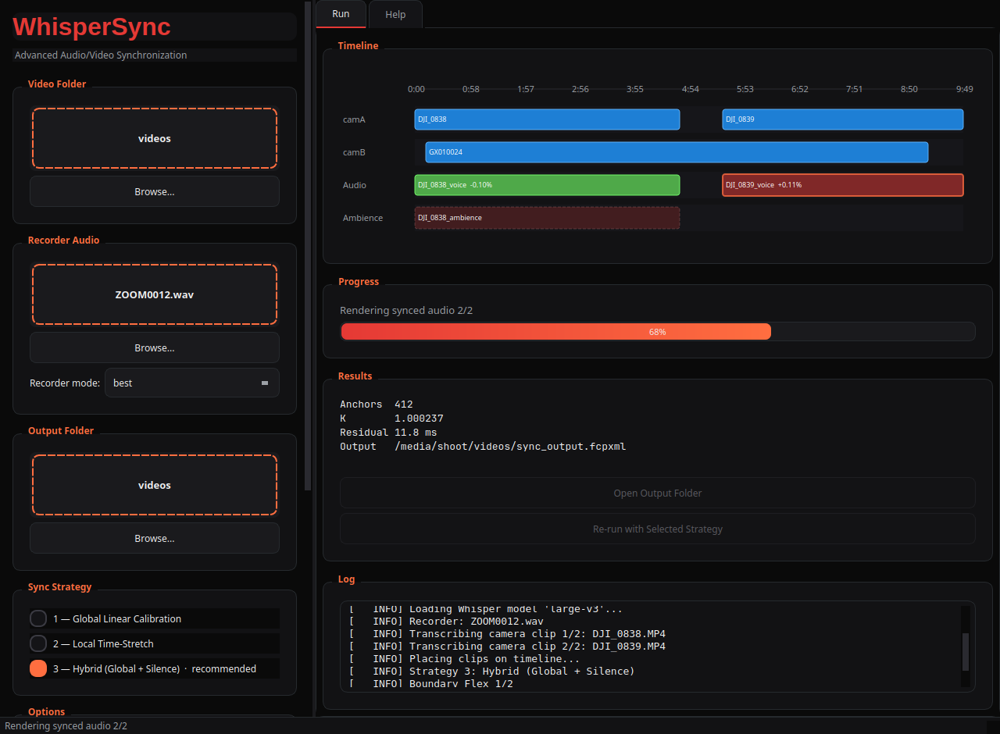
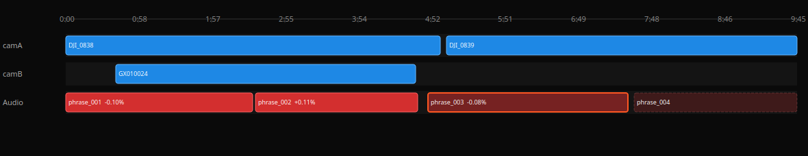
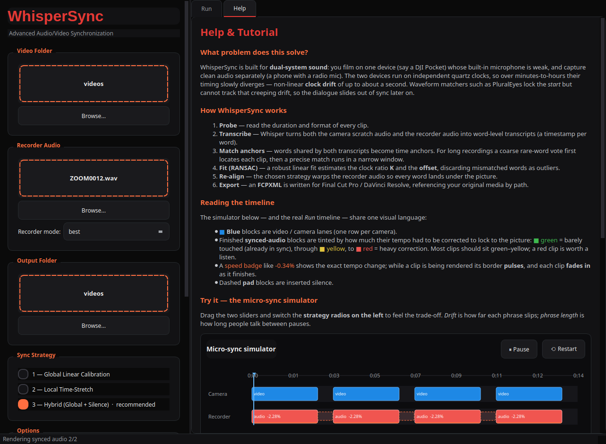

# WhisperSync — Advanced Audio/Video Synchronization Tool


**Русский** · [English](README.en.md)

---

**WhisperSync** — это инструмент для синхронизации звука и видео при dual-system recording: камера снимает видео с черновым звуком, а внешний рекордер (петличка, Zoom, Tascam) записывает чистый звук отдельно. WhisperSync автоматически находит точное временное смещение между треками и генерирует FCPXML-проект для Final Cut Pro или DaVinci Resolve.



> Главное окно: drag-and-drop источников, выбор стратегии, многодорожечный таймлайн с живыми статусами и лог в реальном времени.

Принцип работы: **транскрипция** → **поиск якорей** → **вычисление K/offset** → **стратегия синхронизации** → **рендер синхронного аудио** → **FCPXML-экспорт**.

Используя [faster-whisper](https://github.com/SYSTRAN/faster-whisper) (CTranslate2), WhisperSync транскрибирует оба аудиопотока с word-level таймстемпами, находит совпадающие слова (якоря) через последовательностное выравнивание, применяет RANSAC-регрессию для устойчивого определения линейного дрейфа часов (K = скорость, offset = смещение), а затем одной из стратегий синхронизации собирает звук рекордера под картинку. Рендер сохраняет исходные каналы и битность рекордера (без принудительного даунмикса в моно/16-бит) и использует прозрачный ресемплинг вместо time-stretch там, где реальный дрейф часов достаточно мал.

Результат — FCPXML-файл, ссылающийся на исходные видео и на рендеренные синхронные аудиофайлы, готовый к импорту в Final Cut Pro или DaVinci Resolve. Исходные медиафайлы никогда не изменяются.

## Содержание

- [Features](#features)
- [Screenshots](#screenshots)
- [Requirements](#requirements)
- [Installation](#installation)
- [Usage](#usage) — [GUI](#gui) · [CLI](#cli)
- [Strategies Guide](#strategies-guide)
- [Configuration](#configuration)
- [Troubleshooting](#troubleshooting)
- [Architecture](#architecture)
- [Contributing](#contributing)
- [License](#license)

## Features

- **3 стратегии синхронизации** — Global Linear (линейный дрейф), Local Time-Stretch (нелинейный дрейф) и Hybrid (универсальная, рекомендуемая)
- **Bit-perfect рендер** — сохраняет каналы и битность рекордера сквозь весь пайплайн; прозрачный ресемплинг вместо atempo/WSOLA на малых дрейфах (< 0.5%); фейды только на реально разрывных швах
- **Seam-snap-to-silence** — границы кусков в piecewise-стратегиях привязываются к паузам между словами, чтобы шов никогда не попадал внутрь слова
- **Boundary Flex** — акустическое доуточнение каждого фрагмента кросс-корреляцией (GCC-PHAT) для покадрового губ-синка, включено по умолчанию
- **PyQt6 GUI** с dark theme, drag-and-drop зонами, визуализацией стратегий и многодорожечным таймлайном
- **CLI headless mode** — полный контроль через командную строку, JSON-вывод для автоматизации (`--json` шлёт прогресс в stderr, отчёт — в stdout)
- **Кэш транскрипций** по SHA-256 (с учётом реального device/compute_type) — повторный запуск без перетранскрибации
- **FCPXML export** — рендеренное синхронное аудио + ссылки на исходные видео
- **RANSAC-регрессия** и двухступенчатый фильтр выбросов — устойчивое определение смещения и дрейфа даже с ошибочными совпадениями
- **Auto-strategy** — рекомендация подходящей стратегии по характеру дрейфа, если выбранная не оптимальна
- **Акустический fallback** — если у клипа нет ни одного текстового совпадения, грубая кросс-корреляция по волновым формам без слов (музыка, шум, чужой язык)
- **Per-camera калибровка губ-синка** — постоянная поправка «микрофон↔губы», которую не видит ни один акустический метод
- **NVIDIA GPU** ускорение через ctranslate2 (CUDA/cuDNN) с CPU fallback — torch не обязателен
- **Kроссплатформенность** — Windows, macOS, Linux

## Screenshots

### Многодорожечный таймлайн



Отдельная строка на каждую камеру и на каждую аудиодорожку. Видно реальное
положение клипа (`DJI_0838` и `DJI_0839` с паузой между ними; вторая камера
`GX010024` со своим смещением на отдельной дорожке), изменение скорости аудио
(`−0.10%`, `+0.11%`) и живой статус: **done** (залит), **working** (оранжевая
рамка), **pending** (пунктир). Наведение на клип показывает offset / duration /
in-point / speed / status.

### Схемы стратегий

| Strategy 1 — Global Linear | Strategy 2 — Local Time-Stretch | Strategy 3 — Hybrid |
|----------------------------|---------------------------------|----------------------|
|  |  |  |
| Один блок, равномерное масштабирование | Сегменты, каждый со своим коэффициентом | Фразы корректируются + паузы добирают остаток |

### Вкладка «Help» и интерактивный симулятор



Вкладка **Help** — это встроенный учебник: он подробно описывает весь процесс и
содержит интерактивный **симулятор микро-синхронизации**. Двигайте ползунки
**дрейфа** и **длины фразы**, переключайте стратегию слева — и смотрите, как
дорожка рекордера (красная) перестраивается под картинку (синяя), ровно как в
настоящем таймлайне. Показатели **точности** и **индекса искажения** наглядно
демонстрируют компромисс между тайм-стретчем и паузами. Помогает понять, какую
стратегию выбрать, ещё до запуска.

## Requirements

| Компонент | Минимум | Рекомендуется |
|-----------|---------|---------------|
| Python | >= 3.10 | 3.11+ |
| GPU | CPU fallback | NVIDIA GPU (CUDA/cuDNN) |
| ffmpeg/ffprobe | В PATH | Последняя версия с libsoxr |
| RAM | 4 GB | 8+ GB |
| Диск | 10 GB свободных | SSD |

- **NVIDIA GPU** — рекомендуется для быстрой транскрипции. Транскрипция идёт через [faster-whisper](https://github.com/SYSTRAN/faster-whisper)/ctranslate2, которому **не нужен torch** — CUDA определяется собственной проверкой ctranslate2. Без GPU работает CPU fallback (медленнее, но функционально).
- **ffmpeg / ffprobe** — должны быть доступны в `PATH`. Используются для извлечения аудио, ресемплинга/time-stretch и сборки. Билд с `libsoxr` даёт более качественный ресемплинг (WhisperSync автоматически откатывается на встроенный резамплер, если `libsoxr` недоступен).
- **CUDA / cuDNN** — требуются для GPU-режима. Установите через [NVIDIA CUDA Toolkit](https://developer.nvidia.com/cuda-toolkit).

## Installation

```bash
# 1. Клонируйте репозиторий
git clone https://github.com/Bormotoon/WhisperSync.git
cd WhisperSync

# 2. Создайте виртуальное окружение
python -m venv venv
source venv/bin/activate   # Linux/macOS
# venv\Scripts\activate    # Windows

# 3. Установите зависимости
pip install -r requirements.txt

# 4. Проверьте окружение
python -m whispersync.engine.system_check
```

Скрипт `system_check.py` проверит наличие ffmpeg, CUDA (через ctranslate2 — тот же путь, что использует движок транскрипции в рантайме), Python, зависимости, `.sep-venv` (опциональная фича ambience-track) и свободное место на диске. Вывод — цветная таблица с результатами + файл `report.json` в текущей директории.

## Usage

### GUI

```bash
python main.py
```


PyQt6 GUI с dark theme:

- **Drag-and-drop** видео-папки и аудиофайла(ов) — можно перетащить сразу
  несколько файлов рекордера; при 2+ файлах становится доступен выбор
  режима `best`/`all` (соответствует `--recorder-mode`)
- Выбор стратегии (3 radio-кнопки) и опции (timebase, crossfade, Boundary Flex, pause ducking, ambience track)
- Кнопка **Transcription Settings...** — модальный диалог с моделью, языком,
  device, compute-type, initial-prompt и режимом транскрипции (fast/quality),
  ранее доступными только через CLI/JSON-конфиг
- Кнопка **SYNC** — запуск синхронизации
- Кнопка **Re-run with Selected Strategy** (активна после успешного прогона) —
  повторный запуск с выбранной сейчас стратегией; транскрипты уже в кэше,
  поэтому пересинк сразу переходит к выравниванию/рендеру
- Во время первой загрузки модели Whisper (может включать скачивание с
  HuggingFace) строка статуса и лог показывают это явно, а не выглядят
  зависшими
- Схема выбранной стратегии (диаграмма)
- **Многодорожечный таймлайн**: по строке на каждую камеру и на каждую
  аудиодорожку. Видно положение каждого клипа (насколько подвинулся),
  изменение скорости (напр. `+0.10%`) и живой статус — pending (пунктир),
  working (оранжевая рамка), done (залит). Наведите на клип для деталей
  (offset / duration / in-point / speed / status).
- Лог в реальном времени с цветной подсветкой

### CLI

```bash
# Базовый запуск (стратегия по умолчанию — 3, Hybrid)
python main.py --cli \
  --video-dir ./videos \
  --audio-file rec.wav \
  --output out.fcpxml

# Strategy 1 — Global Linear
python main.py --cli \
  --video-dir ./videos \
  --audio-file rec.wav \
  --strategy 1 \
  --output out.fcpxml

# Strategy 2 — Local Time-Stretch
python main.py --cli \
  --video-dir ./videos \
  --audio-file rec.wav \
  --strategy 2 \
  --output out.fcpxml

# Dry run — только выравнивание, без обработки аудио
python main.py --cli \
  --video-dir ./videos \
  --audio-file rec.wav \
  --dry-run

# JSON-вывод для автоматизации (прогресс идёт в stderr, отчёт — в stdout)
python main.py --cli \
  --video-dir ./videos \
  --audio-file rec.wav \
  --json 2>/dev/null

# Язык транскрипции
python main.py --cli \
  --video-dir ./videos \
  --audio-file rec.wav \
  --language ru

# Конкретная модель Whisper
python main.py --cli \
  --video-dir ./videos \
  --audio-file rec.wav \
  --model large-v3 \
  --device cpu \
  --compute-type int8

# Версия
python main.py --cli --version
```

### CLI Options

| Флаг | Тип | Описание |
|------|-----|----------|
| `--video-dir` | Path | **Обязательный.** Папка с видеофайлами |
| `--audio-file` | Path | **Обязательный.** Файл аудио с рекордера (можно указать несколько раз) |
| `--strategy` | int | Стратегия: `1`, `2` или `3` (по умолчанию — `WhisperSyncConfig.default_strategy`, `3`/Hybrid). `4` принимается как устаревший алиас `3` |
| `--output` | Path | Путь для FCPXML (по умолчанию `<video-dir>/sync_output.fcpxml`) |
| `--model` | str | Модель Whisper (по умолчанию `large-v3`) |
| `--device` | str | `auto` / `cuda` / `cpu` (по умолчанию `auto`) |
| `--compute-type` | str | `auto` / `float16` / `int8` и т.д. (по умолчанию `auto`) |
| `--batch-size` | int | Размер батча для GPU-инференса, главный рычаг скорости (по умолчанию `16`) |
| `--mode` | str | `fast` (батчевый) или `quality` (последовательный, точнее, ~10× медленнее) |
| `--initial-prompt` | str | Подсказка темы для смещения словаря Whisper |
| `--language` | str | Код языка (`ru`, `en`, ...) или `None` для авто |
| `--fcpxml-version` | str | Версия FCPXML (по умолчанию `1.9`) |
| `--timebase-source` | str | `camera` или `recorder` — источник sample-rate для таймкодов FCPXML |
| `--audio-source-camera` | str | Мультикам: имя подпапки-камеры, с которой берётся звук (по умолчанию авто) |
| `--camera-av-offset-ms` | float | Постоянная калибровка губ-синка (мс) для этой камеры, прибавляется к позиции синхронного аудио (по умолчанию `0`) |
| `--recorder-mode` | str | `best` (одна дорожка, лучший рекордер на клип) или `all` (каждый рекордер на свою дорожку) |
| `--crossfade` / `--no-crossfade` | flag | Фейды на реально разрывных швах (declick), по умолчанию вкл. |
| `--crossfade-ms` | int | Длина фейда в мс (по умолчанию `10`) |
| `--render-workers` | int | Параллельные ffmpeg-процессы рендера (`0`=авто=число ядер, `1`=последовательно) |
| `--boundary-flex` / `--no-boundary-flex` | flag | Акустически уточнять старт каждого фрагмента кросс-корреляцией звука для покадрового губ-синка (по умолчанию **вкл.**) |
| `--pause-duck` / `--no-pause-duck` | flag | Приглушать паузы, где молчат обе дорожки, чтобы скрыть рассинхрон эмбиента (по умолчанию выкл.) |
| `--pause-duck-db` | float | Глубина приглушения пауз в дБ: `0` = выкл. … сильно отрицательное → тишина (по умолчанию `-18`) |
| `--ambience-track` | flag | Дорожка эмбиента камеры без голоса (нужен `.sep-venv`, см. `setup_sep_venv.sh`), по умолчанию выкл. |
| `--render-master-wav` | flag | Дополнительно отрендерить один WAV на весь таймлайн (все синхронные voice-клипы, и эмбиент если включён, смикшированные по своим позициям поверх тишинной подложки) рядом с FCPXML — для пользователей без NLE, по умолчанию выкл. |
| `--save-transcripts` / `--no-save-transcripts` | flag | Сохранять полные транскрипты (JSON+SRT) в `output/transcripts/`, по умолчанию вкл. |
| `--config` | Path | Путь к JSON-конфигу (несуществующий путь — ошибка, а не тихий откат на дефолты) |
| `--no-cache` | flag | Отключить кэш транскрипций |
| `--dry-run` | flag | Только выравнивание, без обработки |
| `--verify` | flag | После успешного прогона измерить реальный губ-синк по каждому клипу через кросс-корреляцию (см. `tools/verify_sync.py`) и вывести сводку |
| `--json` | flag | Вывод отчёта в формате JSON на stdout; весь остальной вывод (прогресс, warnings) идёт в stderr |
| `--verbose` | flag | Подробное логирование |
| `--version` | flag | Показать версию и выйти |

Коды возврата: `0` успех, `1` сбой во время выполнения (нет якорей, ошибка ffmpeg и т.п.), `2` ошибка аргументов/конфигурации.

### Пример вывода (default)

```
=== Sync Complete ===
  Anchors:    42
  K:          1.000237
  Offset:     12.8470 s
  Residual:   23.4 ms
  Output:     output/sync_output.fcpxml
```

## Strategies Guide

| Стратегия | Название | Когда использовать |
|-----------|----------|--------------------|
| **1** | Global Linear | Линейный дрейф часов (наиболее частый случай). Простая коррекция: один тайм-конформ коэффициент на весь файл. |
| **2** | Local Time-Stretch | Нелинейный дрейф, меняющийся темп. Сегменты между якорями растягиваются/сжимаются локально. |
| **3** | Hybrid (Global + Silence) | Универсальный, **рекомендуемый по умолчанию**. Каждая фраза корректируется глобальным `K` клипа и ставится по своему якорю, остаток поглощается паузой. Устойчив к нелинейному дрейфу. |

> **О «тональности».** Для реального дрейфа часов (обычно доли процента) WhisperSync автоматически использует прозрачный ресемплинг вместо time-stretch (`atempo`/WSOLA) — питч сдвигается на ту же долю процента (неслышимо на речи), но без фазовых артефактов WSOLA. `atempo` включается только когда фактическая коррекция куска выходит за этот порог (см. `stretch_method`/`RESAMPLE_CONFORM_MAX_DEVIATION` в конфиге).

> **Заикание на швах.** В piecewise-стратегиях (2, 3) границы кусков привязываются к паузам между словами рекордера (seam-snap-to-silence), а не режутся точно по таймкоду якоря — это убирает характерный мид-ворд stutter («подготовил» → «подга-га-товил») без искажения синхронизации.

> **Размещение клипов.** Каждый видеоклип выравнивается к рекордеру независимо, и его позиция на таймлайне берётся из совпавших таймкодов. Клипы не обязаны идти встык — реальные паузы между записями сохраняются. Клип с недостаточным числом якорей (`min_anchors`) не доверяется таймкод-фиту и укладывается по порядку имён с предупреждением.

> **Мультикамера.** Положите клипы каждой камеры в отдельную подпапку внутри `--video-dir` (например, `videos/camA/`, `videos/camB/`). Каждая камера ляжет на свою дорожку (`lane 1, 2, …`). Чистый звук синхронизируется один раз с камеры-референса (`--audio-source-camera`, по умолчанию выбирается автоматически по лучшему выравниванию), чтобы не задваиваться на углах. Видеофайлы, оставшиеся прямо в корне `--video-dir` при наличии подпапок-камер, игнорируются с предупреждением. Длинные источники (рекордер или видео на много часов) обрабатываются через оконный матчинг — клип сначала грубо локализуется по редким словам, затем точно матчится в узком окне.

> **Несколько рекордеров.** Передайте `--audio-file` несколько раз. Каждый клип выравнивается ко всем рекордерам; таймлайн строится по «основному» (с лучшим покрытием). `--recorder-mode best` (по умолчанию) — на каждый клип берётся лучший рекордер, одна аудиодорожка; `--recorder-mode all` — каждый рекордер кладётся на свою дорожку (для нескольких петличек/спикеров). **Важно:** если это просто куски одного устройства (рекордер бьёт запись по 15 мин) — это один источник с одними часами, их надо склеить заранее (`ffmpeg concat`, без потерь), а не передавать как разные рекордеры.

### Strategy 1: Global Linear

**Применение:** Один тайм-конформ коэффициент на весь аудиофайл.

```
Видео:    |========================>
Аудио:    |========================>  × conform(1/K)
```

- Быстро (одна операция на клип)
- Минимальные артефакты
- Идеально для стабильных часов

### Strategy 2: Local Time-Stretch

**Применение:** Каждый сегмент между якорями получает свой коэффициент, с границей, притянутой к ближайшей паузе между словами.

```
Видео:    |=== seg1 ===|=== seg2 ===|=== seg3 ===>
Аудио:    |== seg1 ==>|==== seg2 ====|== seg3 ==>  (каждый со своим коэффициентом)
```

- Точнее при нестабильном дрейфе
- Несколько операций на клип
- Фейды применяются только на швах, которые реально стали разрывными (например, после доуточнения Boundary Flex)

### Strategy 3: Hybrid (Global + Silence)

**Применение:** Каждая фраза корректируется глобальным `K` клипа и ставится по своему якорю; промежутки между фразами поглощают остаток дрейфа.

```
Видео:    |== фраза ==| пауза |== фраза ==| пауза |== фраза ==>
Аудио:    |=×(1/K)===| silence|=×(1/K)===| silence|=×(1/K)==>
```

- Снимает линейный дрейф (как Strategy 1) и доводит по фразам
- Устойчив к нелинейному дрейфу
- Рекомендуемый режим по умолчанию для длинных разговорных записей

## Configuration

### JSON Config

WhisperSync поддерживает JSON-конфигурацию через `--config config.json`. Неизвестные ключи (например, опечатка в имени поля) не приводят к ошибке, но пишут предупреждение в лог — так typo не остаётся незамеченной.

```json
{
    "model": "large-v3",
    "device": "auto",
    "compute_type": "auto",
    "language": "auto",
    "vad_filter": true,
    "beam_size": 5,
    "batch_size": 16,
    "best_of": 1,
    "patience": 1.0,
    "condition_on_previous_text": false,
    "repetition_penalty": 1.1,
    "no_repeat_ngram_size": 3,
    "transcribe_mode": "fast",
    "quality_beam_size": 10,
    "initial_prompt": "",
    "video_exts": [".mp4", ".mov", ".mxf", ".avi", ".mkv"],
    "audio_exts": [".wav", ".mp3", ".m4a", ".flac"],
    "fcpxml_version": "1.9",
    "default_strategy": 3,
    "cache_dir": null,
    "output_dir": null,
    "use_cache": true,
    "save_transcripts": true,
    "timebase_source": "camera",
    "recorder_mode": "best",
    "crossfade_enabled": true,
    "crossfade_ms": 10,
    "stretch_method": "auto",
    "seam_snap_max_s": 0.4,
    "render_workers": 0,
    "min_anchors": 8,
    "anchor_min_confidence": 0.6,
    "phrase_gap_threshold": 0.6,
    "boundary_flex": true,
    "pause_duck_enabled": false,
    "pause_duck_db": -18.0,
    "ambience_track": false,
    "render_master_wav": false
}
```

**Приоритет:** CLI-флаги > JSON-конфиг > значения по умолчанию.

### Описание ключевых полей

| Поле | Тип | Описание |
|------|-----|----------|
| `model` | str | Модель Whisper (`tiny`, `base`, `small`, `medium`, `large-v3`) |
| `device` | str | Устройство: `auto` / `cuda` / `cpu` |
| `compute_type` | str | Тип вычислений: `auto`, `float16`, `int8`, `float32` |
| `language` | str/null | Код языка или `null` для автоопределения |
| `vad_filter` | bool | Фильтрация VAD (Voice Activity Detection) |
| `default_strategy` | int | Стратегия по умолчанию (`1`, `2` или `3`) — единый источник правды для GUI и CLI |
| `stretch_method` | str | `auto` (ресемплинг на малом дрейфе, atempo на большом), `atempo` или `resample` |
| `seam_snap_max_s` | float | Максимальный сдвиг границы куска до ближайшей паузы между словами (сек) |
| `boundary_flex` | bool | Акустическое доуточнение старта каждого куска (вкл. по умолчанию) |
| `acoustic_fallback` | bool | Если у клипа нет текстового совпадения ни с одним рекордером — попробовать грубую акустическую кросс-корреляцию по всей длине рекордера (вкл. по умолчанию). Работает без слов: музыка, шум, малопонятная Whisper речь |
| `min_anchors` | int | Минимальное количество якорей для доверия таймкод-фиту (по умолчанию 8) |
| `anchor_min_confidence` | float | Минимальная уверенность слова, чтобы участвовать в поиске якорей (0.0–1.0) |
| `render_workers` | int | Параллельные ffmpeg-процессы рендера (`0`=авто) |
| `render_master_wav` | bool | Дополнительно отрендерить один WAV на весь таймлайн (voice + эмбиент на своих позициях поверх тишины) для пользователей без NLE (выкл. по умолчанию) |

## Troubleshooting

### CUDA not found

```
CUDA not available, falling back to CPU
```

**Решение:** Установите [NVIDIA CUDA Toolkit](https://developer.nvidia.com/cuda-toolkit) и cuDNN. Запустите `python -m whispersync.engine.system_check` — он проверяет CUDA тем же путём (ctranslate2), что использует движок транскрипции в рантайме, и не требует torch.

### ffmpeg not in PATH

```
ffmpeg not found in PATH
```

**Решение:** Установите ffmpeg и добавьте в PATH:

- **Ubuntu/Debian:** `sudo apt install ffmpeg`
- **macOS:** `brew install ffmpeg`
- **Windows:** Скачайте с [ffmpeg.org](https://ffmpeg.org/download.html) и добавьте в PATH

### Мало якорей (low anchor count)

```
Warning: Only 3 anchors found (minimum: 8)
```

**Причины и решения:**
- Короткое видео — увеличьте длительность записи
- Много шума — включите `vad_filter: true`
- Разные языки — укажите `--language`
- Тихая речь — проверьте уровень сигнала на рекордере

Клип с недостаточным числом якорей не доверяется таймкод-фиту и укладывается по порядку имён (с предупреждением), а не по потенциально ошибочной позиции.

Если у клипа вообще не набралось якорей ни с одним рекордером (полное отсутствие текстового совпадения — музыка, сильный шум, речь на языке, которую Whisper плохо распознаёт), автоматически включается акустический fallback (`acoustic_fallback`, вкл. по умолчанию): грубая кросс-корреляция (GCC-PHAT) по всей длине рекордера напрямую по звуковым волнам, без слов. Работает не так точно, как текстовые якоря, но превращает полный отказ в рабочий (хоть и грубый) результат.

### Большой residual

```
Residual: 156.2 ms (high — results may be inaccurate)
```

**Причины и решения:**
- Не идеально линейный дрейф — попробуйте Strategy 2
- Мало якорей — убедитесь что якори распределены по всей длительности
- Ошибки транскрипции — попробуйте модель `large-v3` вместо `small`

### Кэш транскрипций

Кэш хранится в `~/.cache/whispersync/` (Linux) или аналогичном каталоге. Ключ кэша учитывает фактическое (резолвнутое) устройство/тип вычислений, а не только запрошенное — прогон на GPU и прогон с фолбэком на CPU никогда не путают кэш друг друга. Для сброса:

```bash
# Через CLI
python main.py --cli --no-cache --video-dir ./videos --audio-file rec.wav

# Или удалите кэш вручную
rm -rf ~/.cache/whispersync/
```

## Architecture

```
WhisperSync/
├── main.py                          # Тонкий шим -> whispersync.app:main (для запуска из checkout)
├── whispersync/
│   ├── app.py                       # Entry point (GUI / CLI dispatch), также whispersync-gui
│   ├── cli.py                       # argparse CLI interface
│   ├── config.py                    # WhisperSyncConfig dataclass + JSON loader
│   ├── models.py                    # Word, Segment, Transcript, Anchor, AlignmentMap, MediaClip, SyncPlan...
│   ├── engine/
│   │   ├── pipeline.py              # End-to-end оркестрация (в т.ч. clip_pieces — реальное планирование стратегий)
│   │   ├── transcriber.py           # WhisperEngine + SHA-256 кэш (по резолвнутому device/compute_type)
│   │   ├── matcher.py               # Поиск якорей + RANSAC-регрессия + двухступенчатый фильтр выбросов
│   │   ├── strategies.py            # Реестр имён/описаний стратегий (id -> name/description)
│   │   ├── acoustic.py              # GCC-PHAT кросс-корреляция, Boundary Flex
│   │   ├── separation.py            # Ambience-track через изолированный .sep-venv
│   │   ├── timestretch.py           # ffmpeg resample-conform/atempo/segment/assemble обёртки
│   │   ├── media.py                 # ffprobe, извлечение аудио, мастер-WAV, atempo chain
│   │   ├── export.py                # Генерация FCPXML
│   │   ├── naming.py                # Natural sort имён файлов
│   │   ├── transcript_export.py     # Сохранение транскриптов (JSON+SRT)
│   │   └── system_check.py          # Проверка окружения
│   └── gui/
│       ├── main_window.py           # PyQt6 MainWindow
│       ├── worker.py                # QObject background worker
│       ├── theme.qss                # Dark theme stylesheet
│       └── widgets/                 # DropZone, LogView, StrategyDiagram, TimelinePreview, HelpPage, SyncSimulator
└── tests/                           # pytest test suite
```

### Поток данных

```
Video files + Audio file(s)
        │
        ▼
   probe() ──────────► MediaInfo (в т.ч. каналы/битность аудио)
        │
        ▼
   extract_audio_master() ──► лоссless PCM WAV рекордера (родные каналы, целевой sample rate)
        │
        ▼
   WhisperEngine.transcribe() ──► Transcript (word-level timestamps)
        │
        ▼
   matcher.align() ──► find_anchors() → reject_gross/residual_outliers() → ransac_linear_fit() → AlignmentMap
        │
        ▼
   pipeline.clip_pieces() ──► пьесы (rec_start, duration, factor), с seam-snap-to-silence
        │
        ▼
   [опц.] acoustic.refine_piece_boundaries() ──► Boundary Flex доуточнение
        │
        ▼
   render_pieces() + assemble_continuous() ──► синхронный WAV (родные каналы/битность, дакинг паузы инлайн)
        │
        ▼
   generate_fcpxml() ──► .fcpxml (Final Cut Pro / DaVinci Resolve)
```

## Contributing

Контрибьюции приветствуются! Пожалуйста, ознакомьтесь с гайдами:

- [CONTRIBUTING.md](CONTRIBUTING.md) — как собрать окружение, стиль кода, процесс PR
- [CODE_OF_CONDUCT.md](CODE_OF_CONDUCT.md) — правила сообщества
- [SECURITY.md](SECURITY.md) — как сообщить об уязвимости
- [CHANGELOG.md](CHANGELOG.md) — история изменений
- [PROJECT_ANALYSIS.md](PROJECT_ANALYSIS.md) — полный технический анализ проекта, известные проблемы и план развития

Перед отправкой PR убедитесь, что проходят проверки:

```bash
ruff check whispersync/ tests/
black --check whispersync/ tests/
mypy whispersync/ main.py
pytest
```

## License

MIT License — Copyright (c) 2024-2026 WhisperSync Contributors.

See [LICENSE](LICENSE) for details.
