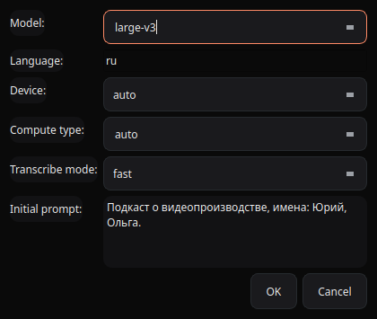

# WhisperSync — Advanced Audio/Video Synchronization

[](https://github.com/Bormotoon/WhisperSync/actions/workflows/ci.yml)


[](https://dalink.to/bormotoon)

**English** · [Русский](README.ru.md)

---

**WhisperSync** synchronizes audio and video for **dual-system sound**: your camera records video with scratch audio, while an external recorder (lavalier, Zoom, Tascam, a phone with a radio mic) captures clean sound separately. The two devices run on independent quartz clocks, so over minutes-to-hours their timing slowly diverges — a creeping, sometimes non-linear **clock drift** of up to a second that waveform matchers lock at the start but cannot track. WhisperSync finds the exact alignment *along the whole recording* and produces a ready-to-import **FCPXML** project for Final Cut Pro or DaVinci Resolve.


> The main window: drag-and-drop sources, strategy selection, a live multitrack timeline, and a real-time log.

The pipeline: **transcribe** → **match word anchors** → **fit K/offset (RANSAC)** → **apply a sync strategy** → **render synced audio** → **export FCPXML**.

Using [faster-whisper](https://github.com/SYSTRAN/faster-whisper) (CTranslate2), WhisperSync transcribes both audio streams with word-level timestamps, matches shared words (anchors) via sequence alignment, runs a RANSAC linear regression to robustly estimate the clock ratio **K** and the **offset**, then re-assembles the recorder audio under the picture with one of three sync strategies. The render preserves the recorder's native channel count and bit depth end to end (no forced mono/16-bit downmix) and uses a transparent resample instead of time-stretch wherever the real clock drift is small enough. Your source media is never modified.

## Table of Contents

- [Features](#features)
- [Screenshots](#screenshots)
- [How It Works](#how-it-works)
- [Requirements](#requirements)
- [Installation](#installation)
- [Quick Start](#quick-start)
- [Usage](#usage) — [GUI](#gui) · [CLI](#cli)
- [Sync Strategies Guide](#sync-strategies-guide)
- [Configuration](#configuration)
- [Output Files](#output-files)
- [Verifying the Result](#verifying-the-result)
- [Troubleshooting](#troubleshooting)
- [Architecture](#architecture)
- [Development & Contributing](#development--contributing)
- [Support the Project](#support-the-project)
- [License](#license)
- [Acknowledgements](#acknowledgements)

## Features

### Synchronization engine

- **Word-level anchor matching** — both tracks are transcribed with per-word timestamps; shared words become time anchors. Works where waveform matchers give up (echoey camera audio, distant mics, noisy rooms).
- **Coarse-then-fine matching for long sources** — a clip is first roughly located inside a possibly multi-hour recorder by rare-word voting, then matched precisely in a narrow window.
- **RANSAC linear fit + two-stage outlier rejection** — a robust estimate of clock ratio K and offset that survives transcription mistakes and false word matches; Unicode-aware token normalization keeps anchors intact in any language («ё», dashes, quotes and all).
- **Three honest sync strategies** — Global Linear, Local Time-Stretch, and the recommended Hybrid (per-phrase placement with pauses absorbing the drift). See the [guide](#sync-strategies-guide).
- **Auto-strategy advice** — after each run, the measured drift character (residual, local rate spread) is checked against the strategy you used; if another would fit better, you get a warning saying exactly why.
- **Acoustic fallback ("Strategy 0")** — a clip with *no* usable transcript match against any recorder (music, noise, a language Whisper garbles, near-silence) falls back to a coarse GCC-PHAT waveform cross-correlation scan to estimate offset/K without words.
- **Boundary Flex** — sub-frame lip-sync refinement: each rendered piece's start is acoustically nudged by GCC-PHAT cross-correlation between camera and recorder audio (on by default).
- **Seam-snap-to-silence** — piece boundaries in the piecewise strategies snap to the nearest inter-word silence in the recorder, so a cut never lands mid-word (no "stutter" artifacts).
- **Per-camera lip-sync calibration** — a constant mic-to-lips delay baked into a camera's own audio pipeline is invisible to any audio-only method; `camera_av_offset_ms` (global or per-camera) corrects it.
- **Anchor-count gating** — a clip with too few anchors is never trusted to a shaky timecode fit; it falls back to filename order with a warning instead of landing at a wildly wrong position.

### Audio quality (bit-perfect render path)

- **Native channels & bit depth preserved end to end** — no forced mono, no forced 16-bit; a 24-bit stereo recorder comes out as 24-bit stereo. Pieces are cut from a lossless PCM master (fixes non-sample-accurate seeking in mp3/m4a sources too).
- **Transparent resample instead of time-stretch** — real clock drift is a fraction of a percent; WhisperSync conforms such pieces by resampling ("varispeed", pitch shift of a few cents — inaudible on speech) instead of `atempo`/WSOLA and its phase artifacts. WSOLA only kicks in when a piece genuinely needs a bigger correction.
- **Fades only where needed** — seams between acoustically continuous pieces are joined butt-to-butt; a fade (which carves an audible dip) is applied only to genuinely discontinuous seams.
- **Single-pass assembly** — concatenation, exact-length padding, and optional pause ducking happen in one ffmpeg encode, not a chain of lossy generations; `libsoxr` resampling when available.
- **Pause ducking (optional)** — attenuates the recorder during pauses where *both* tracks are silent (computed from full word lists, not anchor gaps), hiding any ambience desync between phrases.

### Inputs & outputs

- **Multi-camera** — put each camera's clips in its own sub-folder; each camera gets its own timeline lane, and the clean audio is synced once from a reference camera (auto-picked or `--audio-source-camera`).
- **Multiple recorders** — pass `--audio-file` several times; `--recorder-mode best` picks the strongest recorder per clip (one audio lane), `all` puts every recorder on its own lane (multi-mic/multi-speaker shoots).
- **FCPXML export** (v1.9 by default) — references your untouched video files plus the rendered synced WAVs, with honest per-asset audio channel/rate attributes; validated before it's handed to you.
- **`--render-master-wav`** — additionally mixes every synced voice clip (and the ambience track, if enabled) at its timeline offset onto one silence-padded WAV spanning the whole timeline, for people without an NLE.
- **Ambience track (optional)** — an AI source-separation model strips the camera's own (echoey, slightly off-sync) voice while keeping the room tone, on its own lane next to the clean voice; runs in an isolated `.sep-venv` environment, batch-processed with a single model load.
- **Transcript export** — full transcripts of every recorder and camera clip saved as JSON + SRT next to the output (word-level timestamps included).

### GUI

- **PyQt6 dark-theme app** with drag-and-drop zones for the video folder, recorder file(s), and output folder.
- **Multi-recorder drop zone** — drop several audio files at once; a `best`/`all` recorder-mode picker unlocks at 2+ files.
- **Live multitrack timeline** — one row per camera and per audio lane, showing every clip's real position, applied speed change (e.g. `+0.10%`), and live status: pending (dashed), working (orange outline), done (solid). Hover for offset / duration / in-point / speed.
- **Transcription Settings dialog** — model, language, device, compute type, transcribe mode (fast/quality), and initial prompt without touching a config file.
- **Re-run with Selected Strategy** — after a run, switch the strategy radio and re-run; transcripts are cached, so it skips straight to alignment/render.
- **Weighted overall progress** — one continuous progress bar across all stages (no per-stage resets), plus explicit "Loading Whisper model…" status during a first-time model download.
- **Pipeline warnings surfaced in the log** — unaligned clips, high residual, strategy advice, validation problems.
- **Responsive cancellation** — cancel takes effect mid-clip, even during a large multi-core render.
- **Built-in Help tab** — a full tutorial plus an interactive micro-sync simulator that shows how each strategy re-shapes the audio as you drag drift/phrase-length sliders.

### CLI & automation

- **Full-control headless mode** — every setting reachable via flags or a JSON config; `--json` prints a machine-readable report to stdout while progress goes to stderr.
- **Meaningful exit codes** — `0` success, `1` run failure, `2` usage/config error.
- **`--dry-run`** — scan + transcribe + align only, prints the alignment summary without touching audio.
- **`--verify`** — after rendering, measures the *realized* lip-sync lag per clip via GCC-PHAT and prints a median/p90/max summary (also available standalone as `tools/verify_sync.py`).
- **Environment self-check** — `python -m whispersync.engine.system_check` validates ffmpeg, CUDA (through the same ctranslate2 path the engine uses), dependencies, and disk space; writes `report.json`.

### Performance & reliability

- **NVIDIA GPU acceleration through ctranslate2** — no torch required; batched inference is the main speed lever, with an automatic OOM ladder (smaller batch → smaller compute type → CPU).
- **Transcription cache** — SHA-256-keyed by file, settings, and the *resolved* device/compute type; re-runs skip transcription entirely. Optional age-based pruning (`cache_max_age_days`).
- **One shared render pool** — pieces of all clips render across all CPU cores through a single process pool; each clip's final assembly overlaps the next clips' rendering.
- **In-memory Boundary Flex** — both tracks are decoded to memory once per clip and windows are sliced from arrays (no per-boundary ffmpeg spawns).
- **Fork safety** — the render pool forks only in a single-threaded process (CLI); the GUI gets forkserver/spawn, avoiding the classic fork-in-a-threaded-Qt-process deadlock.
- **Early VRAM release** — the Whisper model is unloaded right after alignment, freeing GPU memory for rendering/separation.
- **Cross-platform** — Windows, macOS, Linux; CI-tested on Python 3.10–3.14 with lock-file reproducibility.

## Screenshots

### Live multitrack timeline


One row per camera and per audio lane. You can see each clip's real position (`DJI_0838` and `DJI_0839` with a genuine gap between them; the second camera `GX010024` at its own offset on a separate row), the audio speed change (`−0.10%`, `+0.11%`), and the live status: **done** (solid), **working** (orange outline), **pending** (dashed).

### Strategy diagrams

| Strategy 1 — Global Linear | Strategy 2 — Local Time-Stretch | Strategy 3 — Hybrid |
|----------------------------|---------------------------------|----------------------|
|  |  |  |
| One block, uniform conform | Per-segment factors between anchors | Phrases corrected + pauses absorb the rest |

### Transcription settings dialog



### Help tab with the interactive simulator


The **Help** tab is a built-in tutorial: it walks through the whole process and includes an interactive **micro-sync simulator**. Drag the **drift** and **phrase length** sliders, switch the strategy on the left — and watch the recorder track (red) re-shape itself under the picture (blue), exactly like the real timeline. The accuracy and distortion-index readouts make the time-stretch-vs-pauses trade-off tangible before you run anything.

## How It Works

1. **Probe** — read the duration and audio format (channels, bit depth, sample rate) of every clip.
2. **Transcribe** — Whisper turns both the camera scratch audio and the recorder audio into word-level transcripts. Multi-hour recorders run through batched GPU inference; results are cached.
3. **Match anchors** — words shared by both transcripts become time anchors. A coarse rare-word vote first locates each clip inside the recorder, then a precise match runs in a narrow window.
4. **Fit** — a RANSAC linear regression estimates the clock ratio **K** and the **offset**, discarding mismatched words as outliers (two-stage: gross window + post-fit residual filter).
5. **Re-align** — the chosen strategy converts the alignment into render "pieces" (recorder start, duration, tempo factor); seam-snap and Boundary Flex refine the cut points; each piece is conformed by transparent resampling or atempo and assembled into one continuous WAV per camera clip, at the recorder's native quality.
6. **Export** — an FCPXML is written referencing your original video files and the rendered synced audio, ready for Final Cut Pro / DaVinci Resolve.

## Requirements

| Component | Minimum | Recommended |
|-----------|---------|-------------|
| Python | ≥ 3.10 | 3.12+ |
| GPU | none (CPU fallback) | NVIDIA GPU (CUDA/cuDNN) |
| ffmpeg / ffprobe | on PATH | a recent build with `libsoxr` |
| RAM | 4 GB | 8+ GB |
| Disk | 10 GB free | SSD |

- **NVIDIA GPU** is recommended for fast transcription. Transcription runs on [faster-whisper](https://github.com/SYSTRAN/faster-whisper)/ctranslate2, which does **not** need torch — CUDA is detected by ctranslate2's own probe. Without a GPU everything still works on CPU (slower).
- **ffmpeg/ffprobe** must be on `PATH` — used for audio extraction, resampling/time-stretch, and assembly. A build with `libsoxr` gives higher-quality resampling (WhisperSync falls back to the built-in resampler automatically).
- **CUDA/cuDNN** are only needed for GPU mode — install via the [NVIDIA CUDA Toolkit](https://developer.nvidia.com/cuda-toolkit).

## Installation

```bash
# 1. Clone the repository
git clone https://github.com/Bormotoon/WhisperSync.git
cd WhisperSync

# 2. Create a virtual environment
python -m venv venv
source venv/bin/activate   # Linux/macOS
# venv\Scripts\activate    # Windows

# 3. Install dependencies
pip install -r requirements.txt

# 4. Check your environment
python -m whispersync.engine.system_check
```

`system_check` verifies ffmpeg, CUDA (through ctranslate2 — the same path the transcription engine uses at runtime), Python, dependencies, the optional `.sep-venv` (ambience-track feature), and free disk space. It prints a colored table and writes `report.json` to the current directory.

**Optional — ambience track.** The AI source-separation feature lives in an isolated environment so its heavy dependencies never touch the main install:

```bash
./setup_sep_venv.sh
```

## Quick Start

```bash
# GUI
python main.py

# CLI — everything on defaults (Hybrid strategy, auto device)
python main.py --cli --video-dir ./videos --audio-file recorder.wav
```

Drop your video folder and recorder file(s) into the GUI, press **SYNC**, and import the generated `sync_output.fcpxml` into Final Cut Pro or DaVinci Resolve.

## Usage

### GUI

```bash
python main.py
```

- **Drag-and-drop** the video folder and recorder audio file(s) — drop several recorder files at once; with 2+ files a `best`/`all` recorder-mode picker unlocks (mirrors `--recorder-mode`).
- Pick a strategy (3 radio buttons) and options: timebase, crossfade, Boundary Flex, pause ducking, ambience track.
- **Transcription Settings…** opens a dialog with model / language / device / compute type / initial prompt / transcribe mode.
- **SYNC** starts the run; the timeline, progress bar, and log update live; **Cancel** takes effect mid-clip.
- After a successful run: **Open Output Folder** and **Re-run with Selected Strategy** (transcripts are cached — a strategy change skips straight to alignment/render).
- The status line tells you exactly what the model stage is doing: a model already on disk reports "found on disk — loading into memory", and only a genuinely missing one reports a (one-time) Hugging Face download. A cached model is loaded straight from its local path — no network round-trips on start.

### CLI

```bash
# Basic (default strategy — 3, Hybrid)
python main.py --cli --video-dir ./videos --audio-file rec.wav --output out.fcpxml

# Strategy 1 — Global Linear, JSON report for automation
python main.py --cli --video-dir ./videos --audio-file rec.wav \
  --strategy 1 --json 2>/dev/null

# Multi-camera (sub-folders) + two lavaliers on separate lanes
python main.py --cli --video-dir ./shoot \
  --audio-file lavA.wav --audio-file lavB.wav --recorder-mode all

# CPU, smaller model, alignment only
python main.py --cli --video-dir ./videos --audio-file rec.wav \
  --device cpu --compute-type int8 --model medium --dry-run

# Post-render lip-sync self-check + a single master WAV for editors without an NLE
python main.py --cli --video-dir ./videos --audio-file rec.wav \
  --verify --render-master-wav
```

#### CLI options

| Flag | Type | Description |
|------|------|-------------|
| `--video-dir` | Path | **Required.** Folder with video files (sub-folders = cameras) |
| `--audio-file` | Path | **Required.** Recorder audio file (repeat for several recorders) |
| `--strategy` | int | `1`, `2`, or `3` (default: `WhisperSyncConfig.default_strategy` = `3`/Hybrid); `4` is accepted as a deprecated alias of `3` |
| `--output` | Path | FCPXML path (default: `<video-dir>/sync_output.fcpxml`) |
| `--model` | str | Whisper model (default `large-v3`) |
| `--device` | str | `auto` / `cuda` / `cpu` (default `auto`) |
| `--compute-type` | str | `auto` / `float16` / `int8` / … (default `auto`) |
| `--batch-size` | int | Batched-inference batch size, the main GPU speed lever (default `16`) |
| `--mode` | str | `fast` (batched) or `quality` (sequential, context-aware, ~10× slower) |
| `--initial-prompt` | str | Domain context to bias Whisper vocabulary |
| `--language` | str | Language code (`ru`, `en`, …); omit for auto-detect |
| `--fcpxml-version` | str | FCPXML version (default `1.9`) |
| `--timebase-source` | str | `camera` or `recorder` — which sample rate anchors FCPXML time values |
| `--audio-source-camera` | str | Multicam: camera sub-folder the synced audio derives from (default: auto) |
| `--camera-av-offset-ms` | float | Constant per-camera lip-sync calibration in ms added to synced audio positions (default `0`) |
| `--recorder-mode` | str | `best` (one lane, strongest recorder per clip) or `all` (every recorder on its own lane) |
| `--crossfade` / `--no-crossfade` | flag | Declick fades on genuinely discontinuous seams (default on) |
| `--crossfade-ms` | int | Fade length in ms (default `10`) |
| `--render-workers` | int | Parallel ffmpeg render processes (`0` = auto = CPU count, `1` = sequential) |
| `--boundary-flex` / `--no-boundary-flex` | flag | Acoustic sub-frame refinement of each piece's start (default **on**) |
| `--pause-duck` / `--no-pause-duck` | flag | Attenuate pauses where both tracks are silent (default off) |
| `--pause-duck-db` | float | Duck depth in dB: `0` = off … very negative → silence (default `-18`) |
| `--ambience-track` | flag | Voice-free camera-ambience lane (needs `.sep-venv`, see `setup_sep_venv.sh`; default off) |
| `--render-master-wav` | flag | Also render one WAV spanning the whole timeline (voice + ambience mixed at their offsets over silence) next to the FCPXML (default off) |
| `--save-transcripts` / `--no-save-transcripts` | flag | Save full transcripts (JSON+SRT) to `output/transcripts/` (default on) |
| `--config` | Path | JSON config file (a missing path is an error, not a silent fallback) |
| `--no-cache` | flag | Disable the transcription cache |
| `--dry-run` | flag | Alignment only, no audio processing |
| `--verify` | flag | Measure realized per-clip lip-sync lag after the render (GCC-PHAT) and print a summary |
| `--json` | flag | JSON report to stdout; progress and warnings go to stderr |
| `--verbose` | flag | Debug logging |
| `--version` | flag | Print version and exit |

Exit codes: `0` success · `1` run failure (no anchors, ffmpeg error, …) · `2` usage/config error.

#### Sample output

```
=== Sync Complete ===
  Anchors:    412
  K:          1.000237
  Offset:     12.8470 s
  Residual:   11.8 ms
  Output:     output/sync_output.fcpxml
```

## Sync Strategies Guide

| Strategy | Name | When to use |
|----------|------|-------------|
| **1** | Global Linear | Linear clock drift (the most common case). One tempo-conform factor for the entire file. Fastest, minimal processing. |
| **2** | Local Time-Stretch | Non-linear drift, varying tempo. Each segment between anchors gets its own factor; boundaries snap to inter-word silences. |
| **3** | Hybrid (Global + Silence) | General purpose, **recommended default**. Each phrase is corrected by the clip's global `K` and placed at its own anchor; the pause between phrases absorbs the residue. Robust to non-linear drift. |

```
Strategy 1        Video:  |========================>
                  Audio:  |========================>  × conform(1/K)

Strategy 2        Video:  |=== seg1 ===|=== seg2 ===|=== seg3 ===>
                  Audio:  |== seg1 ==>|==== seg2 ====|== seg3 ==>   (per-segment factors)

Strategy 3        Video:  |== phrase ==| pause |== phrase ==| pause |== phrase ==>
                  Audio:  |==×(1/K)===| silence|==×(1/K)===| silence|==×(1/K)==>
```

> **About pitch.** Real clock drift is a fraction of a percent, and WhisperSync conforms such pieces with a transparent resample instead of time-stretch — pitch shifts by the same tiny fraction (a few cents, inaudible on speech) with none of WSOLA's phase artifacts. `atempo` engages only when a piece's actual correction exceeds the threshold (`stretch_method` / `RESAMPLE_CONFORM_MAX_DEVIATION`).

> **Mid-word stutter.** In the piecewise strategies (2, 3), piece boundaries snap to the nearest inter-word silence in the recorder (seam-snap-to-silence) instead of cutting exactly on an anchor timecode — this removes the characteristic mid-word stutter without affecting sync accuracy.

> **Auto-strategy.** After every run the measured drift character is compared against the strategy you used; if a different one would fit better, a warning tells you which and why. Re-running is cheap — transcripts are cached.

> **Strategy 0 (acoustic fallback).** If a clip has no usable transcript match against any recorder (music, noise, an unsupported language), a coarse GCC-PHAT cross-correlation grid scan estimates offset/K directly from the waveforms — less precise than word anchors, but it turns a hard failure into a working placement, as long as the same physical sound reaches both mics.

> **Clip placement.** Every clip aligns to the recorder independently, and its timeline position comes from matched timecodes — clips need not be contiguous; real gaps between takes are preserved. A clip with fewer than `min_anchors` anchors falls back to filename order with a warning instead of trusting a shaky fit.

> **Multi-camera.** Put each camera's clips in its own sub-folder of `--video-dir` (e.g. `videos/camA/`, `videos/camB/`). Each camera gets its own lane; the clean audio is synced once from a reference camera (`--audio-source-camera`, auto-picked by best alignment) so it doesn't double up across angles. Video files left in the root of `--video-dir` when camera sub-folders exist are ignored with a warning.

> **Multiple recorders.** Pass `--audio-file` several times. Every clip aligns against every recorder; the timeline is built from the "primary" (best coverage). `--recorder-mode best` (default) keeps one audio lane with the strongest recorder per clip; `all` gives every recorder its own lane (multiple lavaliers/speakers). **Note:** if your files are just sequential chunks of *one* device (a recorder that splits every 15 min), they share one clock — losslessly concatenate them first (`ffmpeg` concat) instead of passing them as separate recorders.

## Configuration

WhisperSync reads a JSON config via `--config config.json`. **Priority: CLI flags > JSON config > defaults.** An unknown key logs a warning (so typos don't silently do nothing), and a missing `--config` path is a hard error.

```json
{
    "model": "large-v3",
    "device": "auto",
    "compute_type": "auto",
    "language": null,
    "vad_filter": true,
    "beam_size": 5,
    "batch_size": 16,
    "transcribe_mode": "fast",
    "quality_beam_size": 10,
    "initial_prompt": "",
    "video_exts": [".mp4", ".mov", ".mxf", ".avi", ".mkv"],
    "audio_exts": [".wav", ".mp3", ".m4a", ".flac"],
    "fcpxml_version": "1.9",
    "default_strategy": 3,
    "cache_dir": null,
    "output_dir": null,
    "use_cache": true,
    "cache_max_age_days": 0,
    "save_transcripts": true,
    "timebase_source": "camera",
    "audio_source_camera": null,
    "camera_av_offset_ms": 0.0,
    "camera_av_offset_ms_by_camera": {},
    "recorder_mode": "best",
    "crossfade_enabled": true,
    "crossfade_ms": 10,
    "output_audio_format": "auto",
    "stretch_method": "auto",
    "seam_snap_max_s": 0.4,
    "render_workers": 0,
    "probe_timeout_s": 30.0,
    "min_anchors": 8,
    "anchor_min_confidence": 0.6,
    "phrase_gap_threshold": 0.6,
    "acoustic_fallback": true,
    "boundary_flex": true,
    "pause_duck_enabled": false,
    "pause_duck_db": -18.0,
    "ambience_track": false,
    "render_master_wav": false
}
```

### Key fields

| Field | Type | Description |
|-------|------|-------------|
| `model` | str | Whisper model (`tiny`, `base`, `small`, `medium`, `large-v3`, or a local path) |
| `device` / `compute_type` | str | `auto` resolves to CUDA when available; compute type picks float16/int8 to fit the hardware |
| `language` | str/null | Language code, or `null` for auto-detect |
| `transcribe_mode` | str | `fast` = batched GPU pipeline; `quality` = sequential with context + anti-hallucination guard (~10× slower, more accurate on hard audio) |
| `default_strategy` | int | Default strategy (`1`/`2`/`3`) — the single source of truth for both GUI and CLI |
| `stretch_method` | str | `auto` (resample on small drift, atempo on large), `atempo`, or `resample` |
| `seam_snap_max_s` | float | Max distance a piece boundary may move to reach an inter-word silence (s) |
| `boundary_flex` | bool | Acoustic sub-frame refinement of each piece's start (default on) |
| `acoustic_fallback` | bool | Waveform cross-correlation fallback for clips with no transcript match (default on) |
| `min_anchors` | int | Minimum anchors to trust a timecode fit (default 8) |
| `anchor_min_confidence` | float | Minimum word confidence to participate in anchor matching (0.0–1.0) |
| `camera_av_offset_ms` (+ `_by_camera`) | float / map | Constant lip-sync calibration added to synced audio positions, globally or per camera sub-folder |
| `render_workers` | int | Parallel ffmpeg render processes (`0` = auto) |
| `render_master_wav` | bool | Also render one WAV spanning the whole timeline (default off) |
| `cache_max_age_days` | float | Delete cached transcripts older than N days at engine start; `0` (default) keeps them forever |

## Output Files

Everything lands next to the FCPXML (default: inside your video folder):

| Path | What it is |
|------|------------|
| `sync_output.fcpxml` | The project file — import into Final Cut Pro / DaVinci Resolve |
| `audio_synced/<clip>_voice.wav` | One continuous synced voice WAV per camera clip, at the recorder's native quality |
| `transcripts/*.json`, `*.srt` | Full transcripts of every recorder and camera clip (word-level timestamps) |
| `ambience/<clip>_ambience.wav` | Voice-free camera ambience (only with `--ambience-track`) |
| `sync_output_master.wav` | Single WAV spanning the whole timeline (only with `--render-master-wav`) |

Source video and recorder files are never modified.

## Verifying the Result

- **`--verify`** — after a successful run, measures the *realized* lag between each rendered voice WAV and its camera audio via GCC-PHAT cross-correlation, printing median/p90/max per clip (and embedding the numbers in `--json` output).
- **`tools/verify_sync.py`** — the same measurement as a standalone tool for any pair of audio files: `python tools/verify_sync.py camera.wav voice.wav [--json]`.
- **`python -m whispersync.engine.system_check`** — environment audit: ffmpeg, CUDA-via-ctranslate2, dependencies, `.sep-venv`, disk space.

## Troubleshooting

### `CUDA not available, falling back to CPU`

Install the [NVIDIA CUDA Toolkit](https://developer.nvidia.com/cuda-toolkit) and cuDNN, then run `python -m whispersync.engine.system_check` — it checks CUDA through ctranslate2, the exact path the transcription engine uses at runtime (torch is not needed).

### `ffmpeg not found in PATH`

- **Ubuntu/Debian:** `sudo apt install ffmpeg`
- **macOS:** `brew install ffmpeg`
- **Windows:** download from [ffmpeg.org](https://ffmpeg.org/download.html) and add to PATH

### Low anchor count

```
Warning: Only 3 anchors found (minimum: 8)
```

Causes and fixes: a very short clip (more speech helps), heavy noise (keep `vad_filter` on), mismatched languages (set `--language`), quiet recorder signal (check levels). A clip below `min_anchors` is placed by filename order with a warning rather than trusted to a shaky fit. If a clip gets *no* text match against any recorder at all, the acoustic fallback (`acoustic_fallback`, on by default) takes over with a waveform cross-correlation scan — coarser, but it works on music/noise/silence, as long as the same physical sound reaches both mics.

### High residual

```
High residual alignment error: 156.2 ms
```

Drift may not be perfectly linear — try Strategy 2 or 3 (watch for the auto-strategy warning naming the better fit); make sure anchors span the whole clip; try `large-v3` over a small model, or `--mode quality` for hard audio.

### Transcription cache

The cache lives in `~/.cache/whispersync/` (per-platform equivalent elsewhere). The key includes the *resolved* device/compute type, so a GPU run and a CPU-fallback run never collide. To reset: `--no-cache` for one run, delete the folder, or set `cache_max_age_days` for automatic pruning.

## Architecture

```
WhisperSync/
├── main.py                          # Thin shim -> whispersync.app:main (checkout runs)
├── whispersync/
│   ├── app.py                       # Entry point (GUI/CLI dispatch); also the whispersync-gui script
│   ├── cli.py                       # argparse CLI
│   ├── config.py                    # WhisperSyncConfig dataclass + JSON loader
│   ├── models.py                    # Word, Segment, Transcript, Anchor, AlignmentMap, MediaClip, SyncPlan, SyncResult
│   ├── engine/
│   │   ├── pipeline.py              # End-to-end orchestration (incl. clip_pieces — the real strategy planner)
│   │   ├── transcriber.py           # WhisperEngine + SHA-256 cache (+ age pruning)
│   │   ├── matcher.py               # Anchors + RANSAC + two-stage outlier filter + strategy recommendation
│   │   ├── strategies.py            # Strategy registry (id -> name/description)
│   │   ├── acoustic.py              # GCC-PHAT cross-correlation: Boundary Flex + acoustic fallback
│   │   ├── separation.py            # Ambience track via the isolated .sep-venv
│   │   ├── timestretch.py           # ffmpeg cut/resample-conform/atempo/assemble/master-mix wrappers
│   │   ├── media.py                 # ffprobe, audio extraction, lossless master, atempo chains
│   │   ├── export.py                # FCPXML generation + validation
│   │   ├── naming.py                # Natural filename sort
│   │   ├── transcript_export.py     # JSON + SRT transcript export
│   │   └── system_check.py          # Environment audit
│   └── gui/
│       ├── main_window.py           # PyQt6 MainWindow
│       ├── worker.py                # Background worker (weighted progress, cancellation)
│       ├── theme.qss                # Dark theme
│       └── widgets/                 # DropZone, LogView, TimelinePreview, StrategyDiagram,
│                                    #   SettingsDialog, HelpPage, SyncSimulator
├── tools/verify_sync.py             # Standalone realized-lag measurement
└── tests/                           # pytest suite (unit + ffmpeg integration markers)
```

### Data flow

```
Video files + recorder file(s)
        │
        ▼
   probe() ──────────────► MediaInfo (incl. audio channels / bit depth)
        │
        ▼
   extract_audio_master() ► lossless PCM master per recorder (native channels, target rate)
        │
        ▼
   WhisperEngine.transcribe() ► word-level Transcript (cached)
        │
        ▼
   matcher.align() ─────► anchors → outlier filters → RANSAC → AlignmentMap (K, offset)
        │                  └─ no match? → acoustic_coarse_align() (GCC-PHAT fallback)
        ▼
   clip_pieces() ───────► pieces (rec_start, duration, factor) with seam-snap-to-silence
        │
        ▼
   refine_piece_boundaries() ► Boundary Flex sub-frame refinement (optional, default on)
        │
        ▼
   shared render pool ──► pieces cut/conformed in parallel → assemble_continuous()
        │                  (native channels/bit depth, inline pause ducking)
        ▼
   generate_fcpxml() ───► .fcpxml + audio_synced/*.wav [+ master WAV, ambience, transcripts]
```

## Development & Contributing

Contributions are welcome — see:

- [CONTRIBUTING.md](CONTRIBUTING.md) — environment setup, code style, PR process
- [CODE_OF_CONDUCT.md](CODE_OF_CONDUCT.md) — community rules
- [SECURITY.md](SECURITY.md) — private vulnerability reporting
- [CHANGELOG.md](CHANGELOG.md) — release history
- [PROJECT_ANALYSIS.md](PROJECT_ANALYSIS.md) — the full technical audit behind the current design

Before opening a PR, make sure the checks pass:

```bash
ruff check .
black --check .
mypy whispersync/ tools/ main.py
pytest                      # unit tests
pytest -m integration       # ffmpeg-backed integration tests
```

CI runs the same suite on Python 3.10–3.14 (dependencies locked on 3.12 for reproducibility).

## Support the Project

WhisperSync is free for noncommercial use and built in the author's spare time. If it saves you hours of manual syncing, consider supporting development:

[](https://dalink.to/bormotoon)

## License

WhisperSync is **source-available** and **free for noncommercial use** under the [PolyForm Noncommercial License 1.0.0](LICENSE).

You may use, copy, modify, and share it for any noncommercial purpose — personal projects, hobby shoots, research, education, and use by charitable/public organizations are all expressly permitted.

**Commercial use requires a separate license.** If you want to use WhisperSync in a commercial product or for commercial work, please [open an issue](https://github.com/Bormotoon/WhisperSync/issues) to discuss commercial licensing.

## Acknowledgements

WhisperSync stands on excellent open technology:

- [faster-whisper](https://github.com/SYSTRAN/faster-whisper) / [CTranslate2](https://github.com/OpenNMT/CTranslate2) — fast Whisper inference
- [OpenAI Whisper](https://github.com/openai/whisper) — the speech-recognition model family
- [FFmpeg](https://ffmpeg.org/) — all audio surgery
- [PyQt6](https://riverbankcomputing.com/software/pyqt/) — the GUI toolkit
- [python-audio-separator](https://github.com/nomadkaraoke/python-audio-separator) — the optional ambience separation
